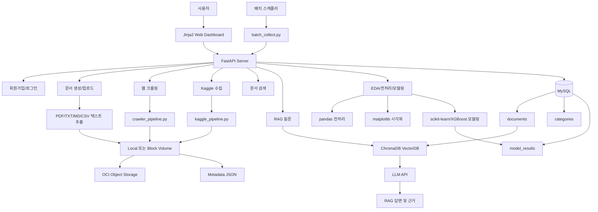
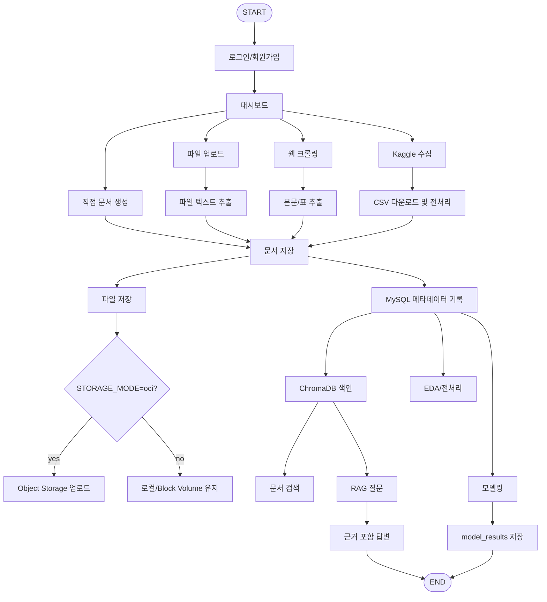
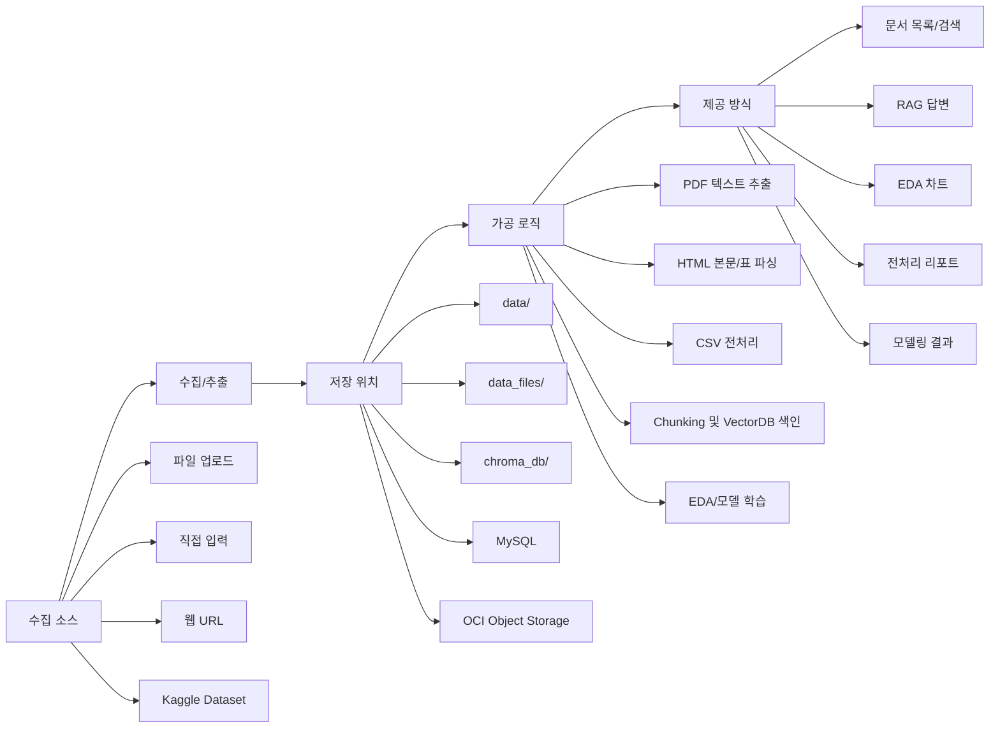
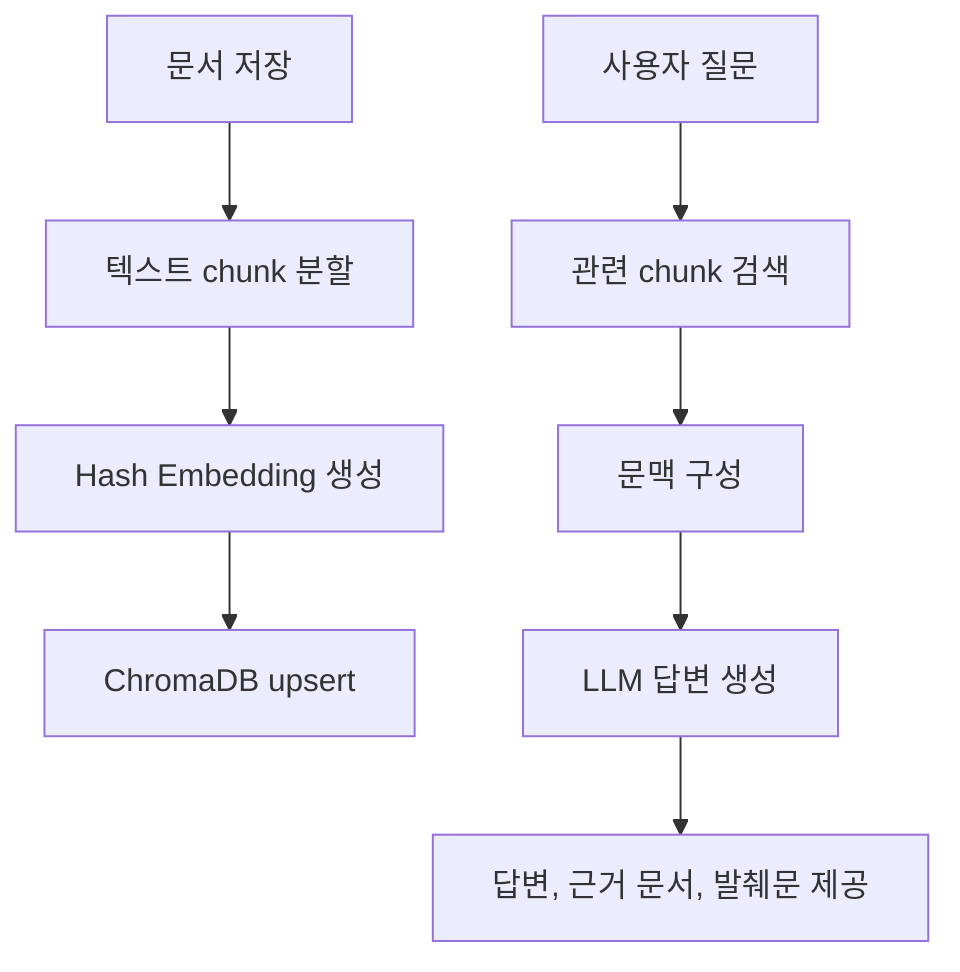

# AI Cloud Data Pipeline

## 1. 서비스 소개

AI Cloud Data Pipeline은 공공데이터, CSV, PDF, 텍스트 문서, 웹 페이지, Kaggle 데이터셋을 수집하고 저장한 뒤 문서 검색, RAG 질의응답, EDA, 전처리 점검, 머신러닝 모델링까지 하나의 웹 대시보드에서 수행할 수 있는 데이터 분석 서비스입니다.

AI 서비스 설계 및 구현 수업에서 여러 데이터를 분석하면서 코드 실행 결과만 확인하는 것보다 데이터의 분포, 변수 간 관계, 주요 영향 요인과 모델 예측 결과를 웹 화면에서 시각적으로 확인하면 분석 내용을 더 쉽게 이해할 수 있다고 생각해 기획하였습니다.

사용자는 다양한 데이터를 수집하거나 업로드할 수 있으며, 문서는 ChromaDB 기반 검색과 RAG에 활용되고 CSV 데이터는 EDA, 전처리 점검, scikit-learn 및 XGBoost 기반 모델링에 활용됩니다.

---

## 2. 주요 기능

| 기능                  | 설명                                                           |
| --------------------- | -------------------------------------------------------------- |
| 회원가입 및 로그인    | 사용자 이름 기반으로 대시보드 접근                             |
| 카테고리 관리         | 문서를 분석 목적별 카테고리로 분류                             |
| 직접 문서 생성        | 제목, 본문, 카테고리를 입력해 문서 저장                        |
| 파일 업로드           | PDF, TXT, MD, CSV 파일 업로드 및 텍스트 추출                   |
| 웹 크롤링             | URL 본문과 HTML 표를 수집하고 표 데이터는 CSV로 변환           |
| Kaggle 수집           | Kaggle 데이터셋 검색, 다운로드, 기본 전처리                    |
| 저장 계층 분리        | 로컬/Block Volume 저장과 OCI Object Storage 업로드 분리        |
| Document Lineage 기록 | source, 원본/가공 파일 경로, metadata, Object Storage URI 저장 |
| VectorDB 색인         | 저장 문서를 ChromaDB에 chunk 단위로 색인                       |
| 문서 검색             | 전체, 제목, 본문, 최근 문서 기준 검색                          |
| RAG 질의응답          | 저장 문서를 근거로 질문에 답변하고 출처 문서 표시              |
| CSV EDA               | 데이터 타입, 결측치, 분포, 상관관계, 주요 차트 확인            |
| 전처리 점검           | 분석 대상 CSV의 컬럼 분류와 전처리 요약 제공                   |
| 머신러닝 모델링       | 분류 모델 학습, 평가 지표 비교, 최고 모델 결과 저장            |
| 배치 수집             | 설정된 Kaggle 데이터셋을 배치로 수집 및 전처리                 |

---

## 3. 사용 시나리오

### 시나리오 1. 공공데이터/문서 수집 후 검색

1. 사용자가 로그인 후 문서 생성 화면에 접속한다.
2. PDF, TXT, MD, CSV 파일을 업로드하거나 직접 문서를 입력한다.
3. 서비스는 파일 내용을 추출하고 원본/가공 파일을 저장한다.
4. 문서 정보와 저장 위치가 MySQL의 `documents` 테이블에 기록된다.
5. 저장된 문서는 ChromaDB에 색인되어 검색과 RAG 질문에 활용된다.

### 시나리오 2. 웹 크롤링과 Kaggle 데이터 수집

1. 사용자가 웹 크롤링 화면에서 URL을 입력한다.
2. 서비스는 웹 페이지의 본문 텍스트와 HTML 표를 수집한다.
3. 표 데이터가 있으면 CSV 파일로 변환하여 저장한다.
4. 사용자가 Kaggle 화면에서 데이터셋 ID를 입력하면 CSV를 다운로드하고 기본 전처리를 수행한다.
5. 수집 결과는 문서 목록, 검색, EDA, 모델링 화면에서 이어서 사용할 수 있다.

### 시나리오 3. CSV 분석과 모델링

1. 사용자가 CSV 문서를 선택해 EDA 화면으로 이동한다.
2. 서비스는 컬럼 타입, 결측치, 분포, 상관관계 등 데이터 프로파일을 생성한다.
3. 사용자는 전처리 화면에서 분석 가능 컬럼과 타깃 후보를 확인한다.
4. 모델링 화면에서 타깃 컬럼을 선택하면 여러 모델을 학습하고 평가한다.
5. 최고 모델, 검증 점수, metric JSON이 `model_results` 테이블에 저장된다.

### 시나리오 4. 저장 문서 기반 RAG 질의응답

1. 사용자가 RAG 화면에서 분석 질문을 입력한다.
2. 서비스는 ChromaDB에서 관련 문서 chunk를 검색한다.
3. 검색된 근거 문서를 기반으로 LLM 답변을 생성한다.
4. 사용자는 답변과 함께 참조된 문서 제목, 발췌문, 문서 링크를 확인한다.

---

## 4. 전체 아키텍처

AI Cloud Data Pipeline은 FastAPI 웹 서버, MySQL 메타데이터 저장소, 로컬/Block Volume 파일 저장소, 선택적 OCI Object Storage, ChromaDB VectorDB, Gemini/OpenAI 호환 LLM 호출, 데이터 분석 파이프라인으로 구성됩니다.



### 사용한 OCI 리소스 목록

| OCI 리소스                    | 사용 목적                                              | 프로젝트 설정                                          |
| ----------------------------- | ------------------------------------------------------ | ------------------------------------------------------ |
| Compute VM Instance           | FastAPI 애플리케이션 실행, 배치 스크립트 실행          | `uvicorn main:app --reload`                            |
| Block Volume 또는 로컬 디스크 | 원본 파일, 가공 파일, metadata, ChromaDB 영구 저장     | `LOCAL_STORAGE_ROOT=data`, `data_files/`, `chroma_db/` |
| Object Storage Bucket         | 원본/가공/metadata 파일을 객체 저장소에 백업 또는 공유 | `STORAGE_MODE=oci`, `OCI_BUCKET_NAME`, `OCI_NAMESPACE` |
| Virtual Cloud Network         | VM, DB, Object Storage 접근을 위한 네트워크 구성       | OCI 배포 환경에서 구성                                 |
| MySQL Database                | 사용자, 카테고리, 문서 lineage, 모델링 결과 저장       | `DB_HOST`, `DB_NAME`, `documents`, `model_results`     |
| IAM Policy/API Key            | Object Storage 업로드 권한 및 OCI SDK 인증             | `OCI_CONFIG_FILE`, `OCI_CONFIG_PROFILE`                |

기본 개발 환경에서는 `STORAGE_MODE=local`로 실행되며, OCI 배포 시에는 VM에 연결된 Block Volume 경로를 로컬 저장소로 사용하고 필요한 경우 Object Storage 업로드를 활성화할 수 있습니다.

---

## 5. Workflow 다이어그램



---

## 6. 데이터 흐름 상세 설명

이미지 평가 기준의 핵심 흐름인 `수집 소스 -> 저장 위치 -> 가공 로직 -> 제공 방식`은 다음과 같습니다.



### 6.1 수집 소스

| 수집 소스       | 처리 파일/모듈        | 설명                                         |
| --------------- | --------------------- | -------------------------------------------- |
| 직접 입력       | `main.py`             | 사용자가 제목과 본문을 입력해 문서 생성      |
| 파일 업로드     | `main.py`, `pypdf`    | PDF, TXT, MD, CSV 파일 업로드 및 텍스트 추출 |
| 웹 페이지       | `crawler_pipeline.py` | URL 본문 텍스트와 HTML 표 수집               |
| Kaggle 데이터셋 | `kaggle_pipeline.py`  | Kaggle API로 CSV 다운로드 및 기본 전처리     |
| 배치 수집       | `batch_collect.py`    | `.env`에 설정된 Kaggle 데이터셋 자동 수집    |

### 6.2 저장 위치

| 저장 위치          | 저장 내용                                              |
| ------------------ | ------------------------------------------------------ |
| `data/`            | 원본/가공 데이터, metadata JSON, local storage root    |
| `data_files/`      | 업로드 CSV 등 분석 대상 파일                           |
| `chroma_db/`       | ChromaDB 영구 VectorDB 저장소                          |
| MySQL              | 사용자, 카테고리, 문서 metadata, 모델링 결과           |
| OCI Object Storage | `STORAGE_MODE=oci`일 때 원본/가공/metadata 객체 업로드 |

### 6.3 가공 로직

1. 업로드 파일은 확장자에 따라 PDF 텍스트 추출, 텍스트 디코딩, CSV 프로파일링으로 분기됩니다.
2. 웹 크롤링 결과는 본문 문서와 HTML 표 CSV로 분리 저장됩니다.
3. Kaggle 데이터셋은 다운로드 후 CSV 탐색, 결측치/컬럼 정보 기반 기본 전처리 metadata를 생성합니다.
4. 문서 본문은 chunk로 분할되어 ChromaDB에 색인됩니다.
5. CSV 문서는 pandas로 EDA 차트와 전처리 요약을 생성합니다.
6. 모델링 화면에서는 타깃 컬럼 기준으로 분류 모델을 학습하고 평가 결과를 저장합니다.

### 6.4 제공 방식

| 제공 화면/API                 | 설명                                   |
| ----------------------------- | -------------------------------------- |
| `/dashboard`                  | 수집/검색/분석으로 이동하는 메인 화면  |
| `/documents/list`             | 저장된 문서 목록과 source lineage 확인 |
| `/documents/search-page`      | 제목, 본문, 전체, 최근 문서 검색       |
| `/rag`                        | 저장 문서 기반 RAG 질의응답            |
| `/eda`                        | CSV 분석 대상 선택                     |
| `/eda/{document_id}/charts`   | EDA 차트 및 데이터 프로파일 표시       |
| `/preprocess`                 | 전처리 점검 대상 선택                  |
| `/preprocess/{document_id}`   | 컬럼 분류, 결측치, 타깃 후보 확인      |
| `/eda/{document_id}/modeling` | 머신러닝 모델링 결과 표시              |

---

## 7. RAG 처리 흐름



### RAG 동작 과정

1. 문서가 생성되거나 수집되면 `rag.py`의 `upsert_document`가 실행됩니다.
2. 본문은 chunk 단위로 나뉘고 metadata와 함께 ChromaDB에 저장됩니다.
3. 사용자가 질문하면 관련 chunk를 검색합니다.
4. 검색된 문서 발췌문으로 context를 구성합니다.
5. LLM API를 호출해 근거 기반 답변을 생성합니다.
6. 답변과 함께 참조 문서 제목, 발췌문, 문서 ID를 화면에 표시합니다.

---

## 8. 기술 스택

| 구분             | 기술                                                            |
| ---------------- | --------------------------------------------------------------- |
| Backend          | FastAPI, Uvicorn                                                |
| Template         | Jinja2                                                          |
| Database         | MySQL, SQLAlchemy, PyMySQL                                      |
| VectorDB         | ChromaDB                                                        |
| LLM              | OpenAI 호환 API 설정, `.env`의 `OPENAI_API_KEY`, `OPENAI_MODEL` |
| Data Processing  | pandas                                                          |
| Visualization    | matplotlib                                                      |
| Machine Learning | scikit-learn, XGBoost                                           |
| File Processing  | pypdf                                                           |
| Data Collection  | Kaggle API, urllib/HTMLParser 기반 웹 크롤러                    |
| Cloud Storage    | OCI Object Storage SDK, Block Volume/로컬 파일 저장             |

---

## 9. 프로젝트 구조

```text
AI_Cloud/
├── main.py                 # FastAPI 라우팅, 화면 렌더링, EDA/모델링 로직
├── rag.py                  # 문서 chunking, ChromaDB 색인, RAG 답변 생성
├── database.py             # MySQL 연결 설정
├── models.py               # User, Category, Document, ModelResult DB 모델
├── storage.py              # 로컬/OCI Object Storage 저장 계층
├── batch_collect.py        # 배치 수집 및 전처리 실행 스크립트
├── crawler_pipeline.py     # 웹 페이지 크롤링 및 표/본문 추출
├── kaggle_pipeline.py      # Kaggle 데이터 다운로드 및 전처리
├── templates/              # Jinja2 HTML 템플릿
├── static/                 # CSS 정적 파일
├── data/                   # 원본/처리 데이터 저장 위치
├── data_files/             # 업로드 CSV 저장 위치
├── chroma_db/              # ChromaDB 영구 저장소
├── requirements.txt        # Python 의존성
├── .env.example            # 환경 변수 예시
└── README.md
```

### 폴더별 역할

| 폴더/파일              | 설명                                             |
| ---------------------- | ------------------------------------------------ |
| `main.py`              | 서비스 화면, API 라우팅, 데이터 분석/모델링 제어 |
| `rag.py`               | VectorDB 색인, 검색, RAG 답변 생성               |
| `storage.py`           | 로컬 저장과 OCI Object Storage 업로드 추상화     |
| `crawler_pipeline.py`  | 웹 페이지 본문과 HTML 표 수집                    |
| `kaggle_pipeline.py`   | Kaggle 데이터셋 다운로드 및 전처리               |
| `batch_collect.py`     | 정기 데이터 수집용 배치 실행                     |
| `templates/`           | 대시보드, 문서, RAG, EDA, 모델링 화면            |
| `static/`              | 화면 스타일 CSS                                  |
| `data/`, `data_files/` | 원본/가공 파일 저장소                            |
| `chroma_db/`           | ChromaDB VectorDB 파일                           |

---

## 10. 설치 및 실행 방법

### 1. 프로젝트 클론

```bash
git clone <repository-url>
cd AI_Cloud
```

### 2. 가상환경 생성

```bash
python -m venv venv
```

### 3. 가상환경 실행

Windows PowerShell 기준:

```bash
venv\Scripts\activate
```

macOS 또는 Linux 기준:

```bash
source venv/bin/activate
```

### 4. 패키지 설치

```bash
pip install -r requirements.txt
```

### 5. MySQL 데이터베이스 생성

```sql
CREATE DATABASE rag_project DEFAULT CHARACTER SET utf8mb4 COLLATE utf8mb4_unicode_ci;
```

### 6. 환경변수 설정

`.env.example` 파일을 복사하여 `.env` 파일을 생성합니다.

Windows PowerShell 기준:

```bash
copy .env.example .env
```

macOS 또는 Linux 기준:

```bash
cp .env.example .env
```

`.env` 파일 예시는 다음과 같습니다.

```env
DB_USER=root
DB_PASSWORD=your_mysql_password
DB_HOST=localhost
DB_PORT=3306
DB_NAME=rag_project

OPENAI_API_KEY=your_openai_api_key
OPENAI_MODEL=gpt-4o-mini

STORAGE_MODE=local
LOCAL_STORAGE_ROOT=data
OCI_BUCKET_NAME=your_object_storage_bucket
OCI_NAMESPACE=your_namespace
OCI_CONFIG_FILE=
OCI_CONFIG_PROFILE=DEFAULT
OCI_OBJECT_PREFIX=ai-cloud-pipeline

BATCH_CATEGORY_NAME=배치 수집 데이터
BATCH_KAGGLE_DATASETS=blastchar/telco-customer-churn,fedesoriano/heart-failure-prediction
```

OCI Object Storage까지 업로드하려면 `STORAGE_MODE=oci`로 변경하고 OCI CLI config 또는 Instance Principal 환경에 맞게 인증을 준비합니다. Kaggle 수집 기능을 사용하려면 `kaggle.json` 또는 `KAGGLE_USERNAME`, `KAGGLE_KEY` 환경 변수 설정도 필요합니다.

### 7. 서버 실행

```bash
uvicorn main:app --reload
```

### 8. 브라우저 접속

```text
http://127.0.0.1:8000
```

---

## 11. 배치 실행 방법

Kaggle 데이터셋을 자동으로 수집하고 전처리하려면 아래 명령을 실행합니다.

```bash
python batch_collect.py
```

정기 수집이 필요하면 위 명령을 cron 또는 Windows 작업 스케줄러에 등록할 수 있습니다. 여러 데이터셋은 `.env`의 `BATCH_KAGGLE_DATASETS`에 쉼표로 구분하여 입력합니다.

---

## 12. 주요 화면 및 API 구성

| Method   | URL                                | 설명                     |
| -------- | ---------------------------------- | ------------------------ |
| GET      | `/`                                | 로그인 화면으로 이동     |
| GET/POST | `/signup`                          | 회원가입 화면 및 처리    |
| GET/POST | `/login`                           | 로그인 화면 및 처리      |
| GET      | `/dashboard`                       | 메인 대시보드            |
| GET/POST | `/documents/new`, `/documents`     | 직접 입력 및 파일 업로드 |
| GET/POST | `/documents/kaggle`                | Kaggle 데이터셋 수집     |
| GET/POST | `/documents/crawl`                 | 웹 페이지 크롤링         |
| GET      | `/documents/search-page`           | 문서 검색 화면           |
| GET      | `/documents/search`                | 문서 검색 실행           |
| GET      | `/documents/list`                  | 문서 목록                |
| GET      | `/documents/{document_id}`         | 문서 상세 보기           |
| GET/POST | `/rag`, `/rag/ask`                 | RAG 질문 화면 및 답변    |
| GET      | `/eda`                             | EDA 분석 대상 선택       |
| GET      | `/eda/{document_id}/charts`        | EDA 차트 화면            |
| GET      | `/preprocess`                      | 전처리 점검 대상 선택    |
| GET      | `/preprocess/{document_id}`        | 전처리 상세 화면         |
| GET      | `/eda/{document_id}/modeling`      | 모델링 결과 화면         |
| GET/POST | `/categories`                      | 카테고리 목록 및 생성    |
| POST     | `/categories/{category_id}/delete` | 카테고리 삭제            |

---

## 13. 실행 가능한 제출 형태

본 프로젝트는 실행 가능한 형태로 제출하기 위해 다음 파일과 폴더를 포함합니다.

| 파일/폴더             | 설명                                                              |
| --------------------- | ----------------------------------------------------------------- |
| `main.py`             | FastAPI 서버 실행 및 라우팅 파일                                  |
| `requirements.txt`    | 실행에 필요한 Python 패키지 목록                                  |
| `.env.example`        | DB, LLM, OCI, 배치 설정 예시                                      |
| `README.md`           | 서비스 소개, 사용 시나리오, 아키텍처, 실행 방법, 데이터 흐름 설명 |
| `templates/`          | 웹 대시보드 화면 템플릿                                           |
| `static/`             | CSS 정적 파일                                                     |
| `rag.py`              | VectorDB/RAG 처리 코드                                            |
| `storage.py`          | 로컬/OCI 저장 계층 코드                                           |
| `crawler_pipeline.py` | 웹 크롤링 코드                                                    |
| `kaggle_pipeline.py`  | Kaggle 수집 및 전처리 코드                                        |
| `batch_collect.py`    | 배치 수집 실행 코드                                               |

---

## 14. 사용 예시

```text
CSV 파일을 업로드하고 EDA 차트를 확인한다.
Kaggle 데이터셋 ID를 입력해 데이터를 수집한다.
웹 페이지 URL을 입력해 본문과 표 데이터를 저장한다.
저장된 문서에서 "고객 이탈에 영향을 주는 요인을 알려줘"라고 질문한다.
심장질환 데이터셋을 선택하고 타깃 컬럼 기준으로 모델링 결과를 확인한다.
문서 검색 화면에서 최근 수집된 자료와 특정 키워드 포함 문서를 찾는다.
```

---

## 15. 한계점

현재 구현에는 다음과 같은 한계가 있습니다.

- 이미지로만 구성된 스캔 PDF는 OCR 기능이 없어 텍스트 추출이 어렵습니다.
- 웹 크롤러는 JavaScript 렌더링이 필요한 페이지보다 정적 HTML 페이지에 더 적합합니다.
- Kaggle 수집은 Kaggle API 인증과 데이터셋 공개 여부에 영향을 받습니다.
- RAG 답변 품질은 저장된 문서의 품질과 LLM API 키 설정 여부에 의존합니다.
- 현재 사용자 관리는 간단한 로그인 흐름 중심이며 운영 환경 수준의 인증/권한 체계는 제한적입니다.
- ChromaDB는 로컬 영구 저장소를 사용하므로 다중 서버 확장 시 별도 VectorDB 운영 구성이 필요합니다.
- Object Storage 업로드는 설정 기반으로 동작하며, 버킷/IAM/네트워크 설정은 OCI 콘솔에서 사전에 준비해야 합니다.

---

## 16. 향후 개선 방향

향후 다음 기능을 추가하여 데이터 파이프라인 서비스의 완성도를 높일 수 있습니다.

- OCR 기능 추가를 통한 스캔 PDF 처리
- Playwright 기반 동적 웹 페이지 크롤링 지원
- 사용자별 권한 관리와 세션 보안 강화
- 수집/전처리/모델링 작업 상태를 비동기 Job Queue로 관리
- Object Storage 업로드 파일의 버전 관리 및 다운로드 링크 제공
- 운영용 로깅, 모니터링, 에러 추적 대시보드 추가
- 다중 VectorDB 또는 관리형 Vector Search 연동
- 모델링 결과 비교 리포트와 재학습 이력 관리 강화
